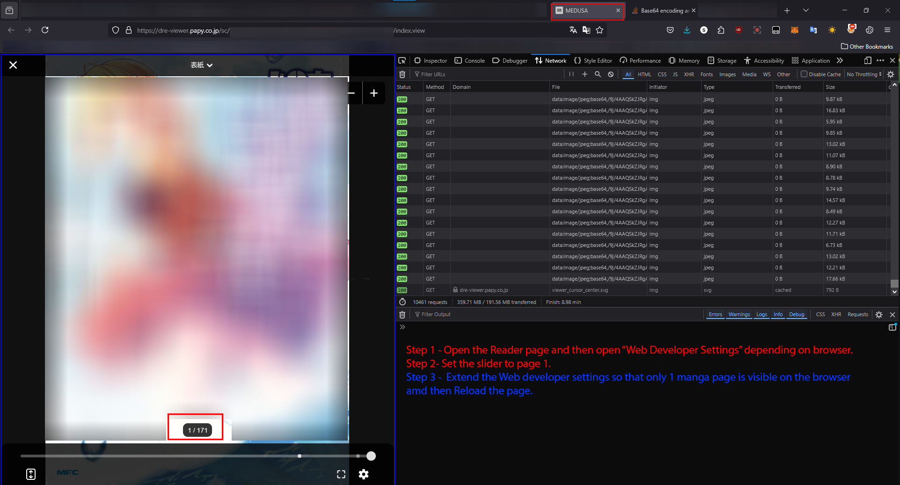
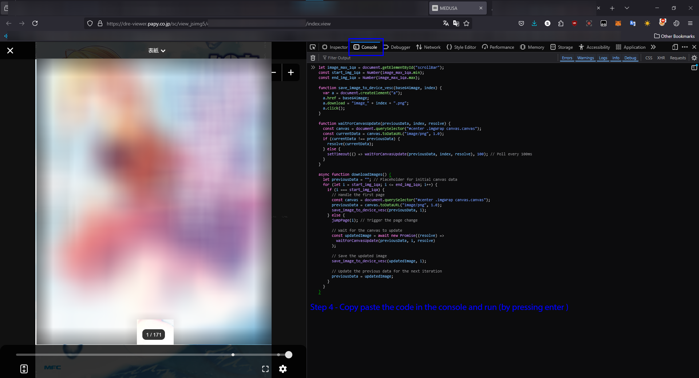
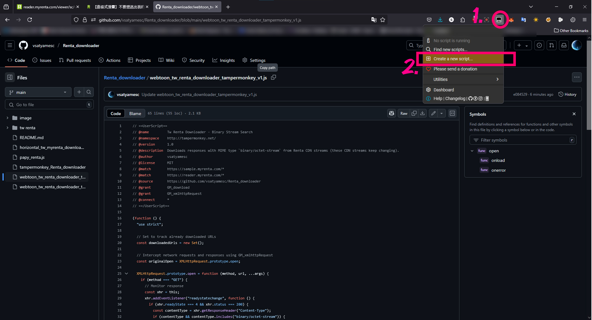
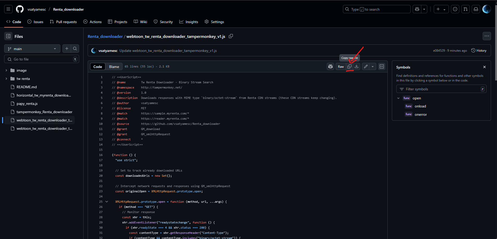
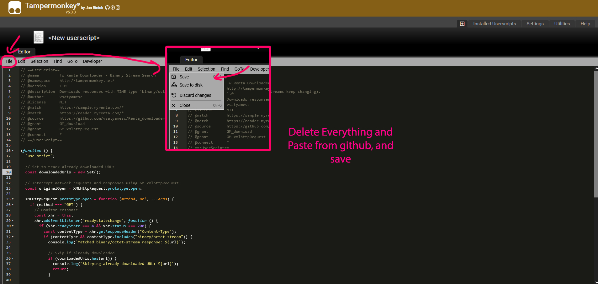
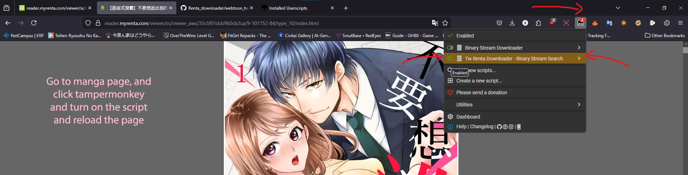

# Renta Downloader Using Firefox OG+Developer's Edition 

You can use this code to download Images from Renta papy, I had to make it as other codes had stopped working. This code should be relatively easy to manage. This works directly on your browser and downloads the files from your browser. So make sure you set your ***Download Path*** to folder where you want to download.
## There's  and  code separetely, use the code wisely. Follow same instructions for both.
## There are two Versions, Tampermonkey Script and Browser Console, I suggest using browser console for Horizontal Reader Downloader, Webtoon is only supported for Tw.renta.com for now, use Tampermonkey to use the script, there are 2 scripts use wisely, refer to usage below for links if you can't figure it out.

## This is memory consuming as it's storing the images into RAM then downloading, so make sure you close any other applications unless you have huge RAM.

## Usage, Manga for TW and Papy Renta [Horizontal Reader Images](#to-download-other-mangas-or-chapters-restart-the-browser--horizontal-reader-help)
  1. Open the Manga reader page after buying the manga or whatever, and then open "Web Developer Settings" browser name may change but the shortcut is "Ctrl + Shift + I" for windows.
  2. Set the Page Slider to 1 and use Horizontal Reader.
  3. Extend or contract the Web Developer settings so that only 1 manga page is visible on the browser and then Reload the page. (Very important)
  4. Copy paste the code from the only javascript file present and then run (by pressing enter).

## Usage for tw webtoon/vertical reader downloader for tw.renta.com, for pros who know how to use tampermonkey.
  1. v1, is a simple Binary Search Downloader, no need to do anything just run.
  2. v2 relies on the image url pattern, just find the image url from network requests and replace it in the script and run, you can see the similar pattern in the script itself.

## Usage for tw webtoon/vertical reader downloader for tw.renta.com, Noobs [Vertical Reader Help](#usage-for-tw-webtoonvertical-reader-downloader-for-twrentacom-noobs--webtoon-reader-help)
  1. You can follow step by step instructions from the images too, anyway you need to use this script 
  2. Start reading the webtoon you want to download, if it opens on new window (so that your extensions are not visible), copy the reader link and open it on normal window so that the extensions are visible to you.
  3. Create a new Tampermonkey script.
  4. Copy paste from the link in step 1.
  5. Go to webtoon reader page, turn on the script if off and reload the page.
  6. The Script is will download the images, however you need to scroll to the bottom of the webtoon yourself, scroll full up to down, and down to up multiple times until you are sure that the chapter is downloaded.

## To Download other mangas or chapters, restart the browser // Horizontal Reader Help
Adding images for help

## Usage for tw webtoon/vertical reader downloader for tw.renta.com, Noobs // Webtoon Reader Help

